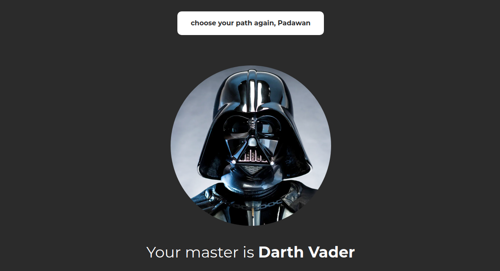

<div align="center">
    
    <br>
</div>

</br>

<h4 align="center">
  Test application for simultaneous api calls, state management and hooks <br>
  <a target="blank" align="center" href="https://star-wars-challenge-beta.vercel.app/">click to access the project <br /> https://star-wars-challenge-beta.vercel.app/</a>
</h4>


<a align="center">
  <a href="#rocket-technologies">Technologies</a>&nbsp;&nbsp;&nbsp;|&nbsp;&nbsp;&nbsp;
  <!--<a href="#warning-prerequisites">Prerequisites</a>&nbsp;&nbsp;&nbsp;|&nbsp;&nbsp;&nbsp; -->
  <a href="#information_source-how-to-use">How To Use</a>
</p>

</br>


## :rocket: Technologies
This project was developed with the following technologies:
-  [ReactJS](https://reactjs.org/)
-  [Typescript](https://www.typescriptlang.org/)
-  [VS Code][vc]
-  [React-Icons](https://react-icons.netlify.com/)
-  [Styled-Components](https://www.styled-components.com/)
-  [React-router-dom](https://www.npmjs.com/package/react-router-dom)
-  [Axios](https://github.com/axios/axios)


## :information_source: How To Use

To clone and run this application, you'll need [Git](https://git-scm.com) From your command line:

```bash

# Clone this repository
$ git clone https://github.com/opabloteixeira/star-wars-challenge

# Go into the repository
$ cd star-wars-challenge

# Install dependencies
$ yarn

# Run the app
$ yarn start

```


Made with ♥ by Pablo Teixeira :male_detective: [My Linkedin](https://www.linkedin.com/in/pablo-teixeira-30713777/)

